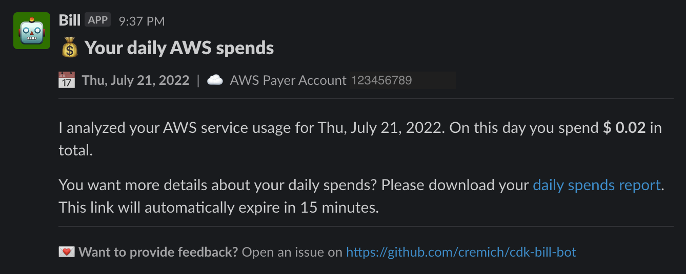

# 👋 Welcome to Bill - the cost optimization bot

[](http://commitizen.github.io/cz-cli/)
[](./CODE_OF_CONDUCT.md)
[](https://github.com/prettier/prettier)
[](https://github.com/cremich/cdk-bill-bot/actions/workflows/release.yml)
[](https://codecov.io/gh/cremich/cdk-bill-bot)
[](https://badge.fury.io/js/@cremich%2Fcdk-bill-bot)


This Construct Library provides L2 and L3 constructs for resources to build AWS Cost and Usage reports using the AWS Cloud Development Kit (CDK).

☝️ Important: Bill uses various AWS services and there are costs associated with these services after the Free Tier usage - please see the [AWS Pricing page](https://aws.amazon.com/pricing/) for details. You are responsible for any AWS costs incurred. No warranty is implied.

---

**⚠️ This is an early alpha pre-release version. The API will be subject to change until the library reaches GA status. Therefore make sure you use an exact version in your `package.json` before it reaches 1.0.0.**

**Please keep this warning in mind, if you already consider to use Bill in production environments!**

---

## 🤖 About Bill

Bill enables AWS customers to proactively monitor their infrastructure costs and identify unforeseen expenses in a timely manner. Bill wants to prevent AWS customers from receiving bad surprises in their monthly bill. Therefore he addresses two primary problem areas:

1.  cost history is not monitored on a regular basis
2.  basic cost optimization best practices are not setup

Bill is a happy bot, if you...

- ...have more money in your pocket
- ...are enabled to monitor your spends proactively

### How does Bill help you?

By analyzing your cost and usage reports, Bill will inform you about your monthly costs on a daily basis. This way, AWS customers will always have an up-to-date snapshot of how their infrastructure costs are progressing. AWS customers can then take direct action in the event of increased costs to prevent unintended suprises in their bill.

In addition to the daily status report, Bill enables various best practices in the area of cost optimization so that you can reliably control your costs. For example, by setting up multi-level AWS budget notifications or enabling cost anomaly detection and notification once anomalies are detected.

### What are Cost and Usage reports?

The AWS Cost and Usage Reports (AWS CUR) contains the most comprehensive set of cost and usage data available. You can use Cost and Usage Reports to publish your AWS billing reports to an Amazon Simple Storage Service (Amazon S3) bucket that you own. You can receive reports that break down your costs by the hour, day, or month, by product or product resource, or by tags that you define yourself.

Source: https://docs.aws.amazon.com/cur/latest/userguide/what-is-cur.html

## 📝 Requirements

- [Create an AWS account](https://portal.aws.amazon.com/gp/aws/developer/registration/index.html) if you do not already have one and log in.
- [AWS CLI](https://docs.aws.amazon.com/cli/latest/userguide/install-cliv2.html) installed and configured
- [Git Installed](https://git-scm.com/book/en/v2/Getting-Started-Installing-Git)
- [AWS Cloud Development Kit](https://docs.aws.amazon.com/cdk/v2/guide/getting_started.html#getting_started_install) (AWS CDK) installed
- [Slack Webhook](https://api.slack.com/messaging/webhooks) created

## 🚀 Getting started

This Construct Library requires the AWS CDK v2 (>= 2.1.0). Please follow the [installation ](https://docs.aws.amazon.com/cdk/v2/guide/getting_started.html#getting_started_install) to install the AWS CDK.

### Installation

You can install Bill in two ways. Either using the CDK library package or by provisioning a default and pre-packaged Cloudformation template with your existing AWS accounts.

### CDK Library for Typescript

Bill can be added into your existing Typescript based CDK applications. Simply include the `@cremich/cdk-bill-bot` as a dependency within your application using either NPM or Yarn:

```sh
npm install @cremich/cdk-bill-bot --save-dev
# or
yarn add @cremich/cdk-bill-bot --save-dev
```

### Cloudformation template

TO BE ADDED

## 🎉 Usage

### Setup Cost and usage report export to S3

In order to receive cost and usage reports, you must have an Amazon S3 bucket in your AWS account to receive and store your reports. When using the `CostAndUsageReport` construct, an Amazon S3 Bucket is implicitly created for you.

> ⚠️ Please keep in mind, that cost and usage reports are only supported in `us-east-1`. The implicit created Bucket will then also be created in `us-east-1` and defaults to the current stack's region.

```javascript
import { CostAndUsageReport } from "@cremich/cdk-bill-bo";

new CostAndUsageReport(this, "cur", {
  compression: Compression.PARQUET,
  format: Format.PARQUET,
  timeUnit: TimeUnit.DAILY,
});
```

If you want to provision a custom Amazon S3 bucket, you can use the `CURBucket` construct and provide a reference to this bucket to the `CUR` construct. This gives you the flexibility, to provision the Amazon S3 bucket in another region while keeping the report provisioned in `us-east-1`

```javascript
import { CostAndUsageReport, CURBucket } from "@cremich/cdk-bill-bo";

const curBucket = new CURBucket(this, "bucket");

new CostAndUsageReport(this, "cur", {
  bucket: curBucket,
  compression: Compression.PARQUET,
  format: Format.PARQUET,
  timeUnit: TimeUnit.DAILY,
});
```

### Use AWS Glue to enable access to your report using Amazon Athena

After you created your report, you can provision a AWS Glue based data catalog for this. This enables Bill and you to analyze your cost and usage reports using Amazon Athena.

If you want to enable a data catalog on a new provisioned report, you can simply call `addDataCatalog()` on your `CostAndUsageReport` construct like

```javascript
import { CostAndUsageReport } from "@cremich/cdk-bill-bo";

const report = new CostAndUsageReport(this, "cur", {
  compression: Compression.PARQUET,
  format: Format.PARQUET,
  timeUnit: TimeUnit.DAILY,
});

report.addDataCatalog();
```

This will create an AWS Glue crawler to crawl your report data, an AWS Glue database that references your metadata as well as an Athena Workgroup to enable you to query your data using Amazon Athena.

If you would like to enable a data catalog on an existing report, you can use the `CostAndUsageDataCatalog` construct independently and reference your existing S3 Bucket:

```javascript
import { CostAndUsageDataCatalog } from "@cremich/cdk-bill-bo";

new CostAndUsageDataCatalog(this, "costs-catalog", {
  curBucket: bucket,
});
```

### Daily spends digest

Bill is able to analyze your spends on a daily bases. Bill will calculate your total costs and send you a digest message via slack. You can enable the daily spends digest by using the following construct and connecting it with your cost and usage data catalog.

```javascript
import { CostAndUsageDataCatalog } from "@cremich/cdk-bill-bot";

new DailySpendsDigest(this, "daily-spends-digest", {
  datacatalog,
  slackWebHookUrl:
    "https://hooks.slack.com/services/WORKSPACE_ID/CHANNEL_ID/personalSecret",
});
```

To use this construct, you have to provide a valid Slack webhook. If the webhok is not valid, the construct creation will during synthesis time. Please follow the official documentation to [create a personal and private webhook](https://api.slack.com/messaging/webhooks). If everything is setup correctly and your first daily spends are analyzed, you will receive a message like the following:



The daily spends digest is orchestrated using AWS Step Functions. You can run the state machine workflow that is created along the `DailySpendsDigest` construct manually at any time. The state machine does not require any special execution input. By default, the state machine will be executed automatically once a day and analyze yesterdays usage data once they are propagated in the underlying cost and usage report.

By default, a daily spends CSV report is ready to be downloaded using a pre-signed URL. The URL will automatically expire after 15 minutes. You can use the report to dive deeper into the daily spends results. Please check out the [sample file](./test/daily-spends/daily-spends.csv) that is provided within this repository.

## 🤔 FAQs

### Can I also use Bill in my multi-account setup?

Bill can basically run in any AWS account but it might not be designed to cover all multi account use cases in detail. Depending on customer feedback, this might be added at a later stage.

### I already have an existing Cost and Usage report export setup. Can Bll reuse this instead of provisioning a new one?

Yes. You can skip the creation of a CUR export managed by Bill and point your existing S3 bucket to the datacatalog construct.

### What channels does Bill support?

Right now, Bill is capable to send notifications to a Slack channel of your choice. In order to enable Bill to send messages via Slack, you have to [create a Slack Webhook](https://api.slack.com/messaging/webhooks).

## 🤝 Contributing

Contributions, issues and feature requests are welcome!

Feel free to check [issues page](https://github.com/cremich/cdk-bill-bot/issues) for open issues or create one for feature requests or if you have general questions.

Be also sure to review our [contributing guidelines](./CONTRIBUTING.md) and [code of conduct](./CODE_OF_CONDUCT.md).
